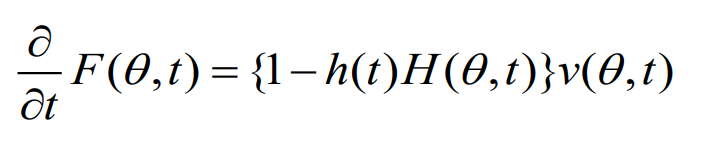
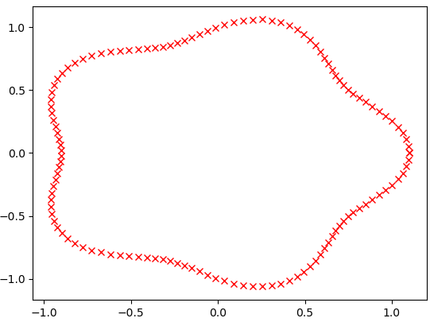
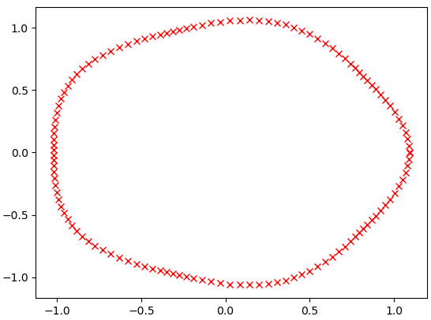
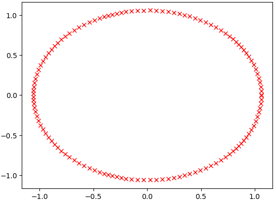
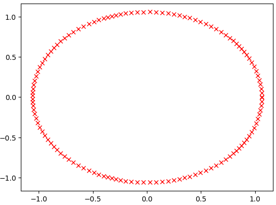
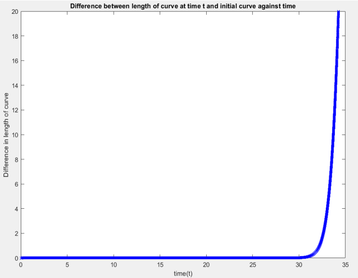

# Surface-area-preserving-mean-curvature-flow
One-file implementation of  surface area preserving mean curvature flow

# Curvature Flow
Curvature flow is a mathematical concept used in differential geometry to describe the evolution of a curve or a surface over time. It involves the deformation of the curve or surface such that the curvature at each point is proportional to the rate of change of the curve or surface at that point. In other words, the curvature of the curve or surface is made to decrease or increase over time smoothly and continuously. A 3D example is shown as follows.

# Governing equation
Surface area preserving mean curvature flow is implemented here in Python. The equation was posed by James A. McCoy in 2003. His paper can be accessed at <https://www.semanticscholar.org/paper/The-surface-area-preserving-mean-curvature-flow-McCoy/ab3f0f6d5b3c4a15cd59a0836e3391d6635da543>.

# Process
1. Initialize the curve with a finite number of points and calculate the length of the curve.
2. Calculate the tangent and the normal vector at each point on the curve.
3. Calculate the mean curvature at each point on the curve and calculate the variable h(t) of the curve.
4. Solving the ode to calculate the coordinates of the points after finite time dt.
5. repeat step 2 to step 4 n time to get the final curve after time n*dt.

# Results
## t=0

## t=0.1

## t=1

## t=10

# Error
The above picture is the difference between the arc length of the curve in time t and the initial arc length, dt = 0.001, number of points = 128. Before 𝑡 = 30, the difference between the length of the curve at time t and the initial 
curve is in the magnitude of 10−3. After the t =30, the difference increases rapidly.

